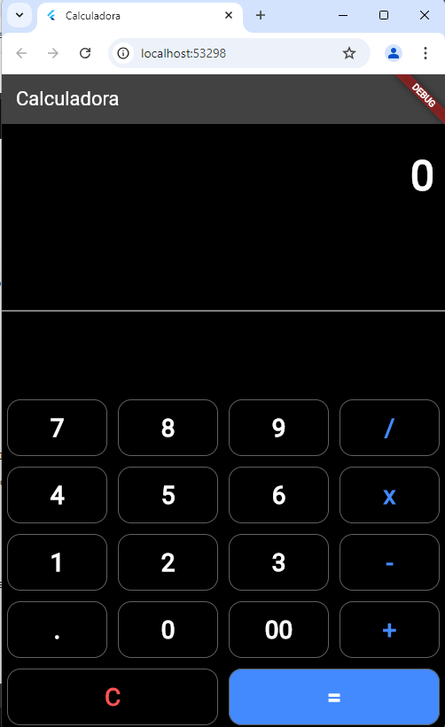

### README.md

```markdown
# Calculadora Flutter

Uma calculadora simples desenvolvida com Flutter.

## 🚀 Começando

Essas instruções vão te ajudar a obter uma cópia do projeto em sua máquina local para desenvolvimento e teste.

### 📋 Pré-requisitos

Certifique-se de ter as seguintes ferramentas instaladas:

- [Flutter](https://flutter.dev/docs/get-started/install) - O SDK Flutter.
- [Dart](https://dart.dev/get-dart) - Linguagem de programação utilizada.
- [Android Studio](https://developer.android.com/studio) - IDE recomendada, mas você pode usar outras IDEs compatíveis com Flutter.

### 🔧 Instalação

1. **Clone o repositório:**

   ```bash
   git clone https://github.com/pHzeraGitHub/Calc_Flutter.git
   ```

2. **Navegue para o diretório do projeto:**

   ```bash
   cd Calc_Flutter
   ```

3. **Instale as dependências:**

   ```bash
   flutter pub get
   ```

4. **Execute o aplicativo:**

   ```bash
   flutter run
   ```

## 📷 Visualização

Aqui está uma captura de tela do aplicativo em execução:



## 🚀 Utilização

Após executar o aplicativo, você verá uma interface simples de calculadora. Utilize os botões para realizar operações básicas de adição, subtração, multiplicação e divisão.

## 🤝 Contribuindo

Se você deseja contribuir para o projeto, siga estas etapas:

1. Faça um fork do repositório.
2. Crie uma nova branch (`git checkout -b feature/nova-funcionalidade`).
3. Faça suas alterações e faça commit (`git commit -am 'Adiciona nova funcionalidade'`).
4. Envie para o repositório remoto (`git push origin feature/nova-funcionalidade`).
5. Crie um Pull Request.

## 📄 Licença

Este projeto está licenciado sob a Licença MIT - veja o arquivo [LICENSE](LICENSE) para mais detalhes.

## 👤 Autor

* **Phillipe Martins* - [pHzeraGitHub](https://github.com/pHzeraGitHub)
```

### Passos para Criar e Adicionar o README.md

1. **Crie o arquivo `README.md`:**
   - No diretório raiz do seu projeto, crie um arquivo chamado `README.md`.

2. **Edite o arquivo `README.md`:**
   - Abra o `README.md` com um editor de texto.
   - Copie e cole o modelo acima no arquivo.
   - Substitua os placeholders:
     - `caminho-para-sua-captura-de-tela.png`: Coloque a URL ou caminho para uma captura de tela do seu projeto (se desejar incluir uma).
     - `Seu Nome`: Substitua pelo seu nome.
     - `Seu Perfil GitHub`: Substitua pelo link para seu perfil no GitHub.

3. **Adicionar, Commit e Enviar para o GitHub:**

   ```bash
   git add README.md
   git commit -m "Adiciona documentação inicial"
   git push
   ```

### Dicas Adicionais

- **Capturas de Tela:** Adicionar uma imagem ajuda a mostrar o visual do projeto. Coloque a imagem na pasta do projeto e atualize o caminho no `README.md`.
- **Detalhes:** Inclua detalhes específicos sobre como usar ou modificar o projeto se necessário.

Se precisar de mais alguma ajuda ou ajustes específicos, é só me avisar!
   ```bash
   git commit -m "Adiciona documentação inicial"
   ```

3. **Envie o commit para o GitHub**:

   ```bash
   git push
   ```

### 4. **Verificar no GitHub**

1. **Acesse o seu repositório no GitHub** ([link para seu repositório](https://github.com/pHzeraGitHub/Calc_Flutter)).
2. **Verifique se o `README.md` está visível** e se o conteúdo está correto.
